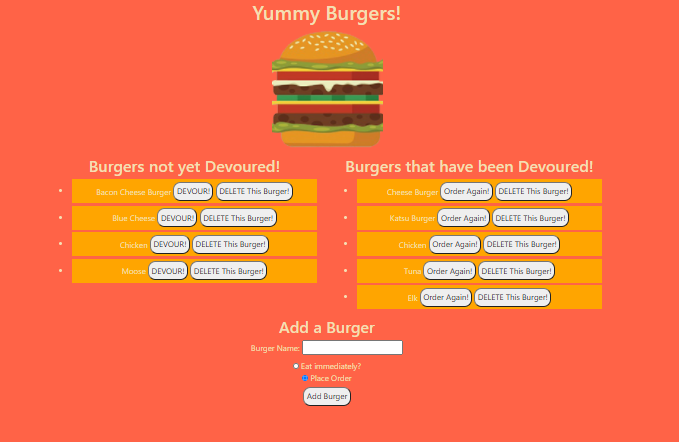

# Eat-Da-Burger
 
   ## Table of Contents: 
   
* [Description](#Description)

* [Installation](#Installation)

* [Usage](#Usage)

* [Contributors](#Contributors)

* [Tests](#Tests)

* [Questions](#Questions)

   ## Description: 
   Eat-Da-Burger is a fantastic full-stack application that allows the user to enter items to be ordered, devour them and reorder them! Utilizing the MVC design pattern the following technologies were utilized: Node.js, MySQL, Express.js, JavaScript, Handlebars, Bootstrap, HTML, CSS and is deployed on Heroku. 
   ## Installation: 

   Installation Instructions

   none
   ## Usage: 

   Usage Information 

   Usage: go to the following link : ….Type a burger you would like to add into the form field, select if you would like to eat it immediately or if you would like to order it. From there you can devour that burger, order a burger again or delete a burger from the list. 

 
 Eat-Da-Burger
 

   ## Contributors: 

   Contribution Guidelines

   @janelle-deane
   ## Tests: 

   Test Instructions

   none
   ## Questions: 
   Feel free to reach out to me either on my github or email. 
   
   Github:
   https://github.com/janelle-deane/
   
   Email:
   janelle.m.deane@gmail.com